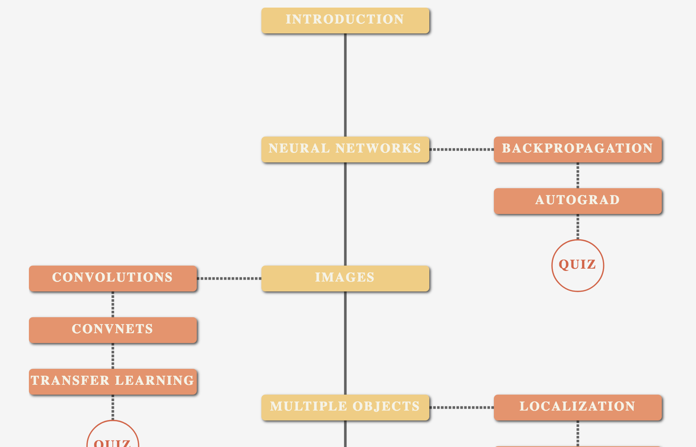

<h1>DeepCourse: Deep Learning for Computer Vision</h1>

<h2> <a href="https://arthurdouillard.com/deepcourse/">arthurdouillard.com/deepcourse/</a></h2>

This is a course I'm giving to the French engineering school EPITA each Fall. This course is the new version (as of 2021) of my lectures serie.
It's given in around 24h, with sessions of 4 hours each made of 2 hours of lessons and 2 hours of coding.

If you find a mistake (in the lesson, notebook, or quiz), please open an issue here. Likewise, if you have ideas to improve this course (should I cover topic X? etc.), please also open an issue.

# Roadmap to do

- [X] Add all major lessons + notebooks + quiz
- New architectures
  - [X] Lesson (transformer, new kind of mlp, involution, NAS, what else?)
  - [X] Notebook transformer
  - [X] Notebook MLP-Mixer
  - [X] Quiz
- Robustness (uncertainty, adversarial attack)
  - [ ] Lesson
  - [ ] Notebook
  - [ ] Quiz
- Continual Learning + domain generalization + out-of-distribution
  - [ ] Lesson
  - [ ] Notebooks
  - [ ] Quiz
 - Graph Neural Network
  - [ ] Lesson
  - [ ] Notebooks
  - [ ] Quiz
 - [ ] Make website look nice on every kind of devices & screens
