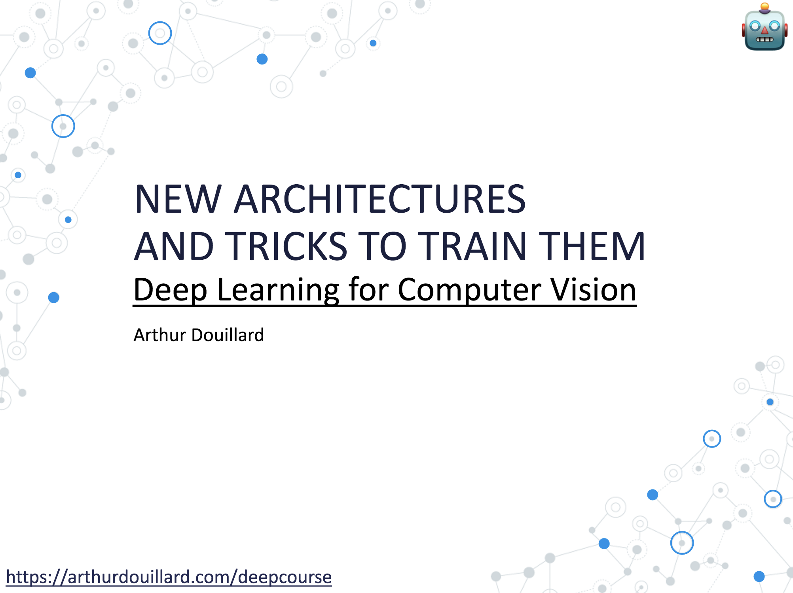

# The lecture

# After the lecture

- [The Illustrated Transormer (NLP)](https://jalammar.github.io/illustrated-transformer/)
- [Blog on transformers for Vision](https://arthurdouillard.com/post/visual_transformers/)
- [Suuuuuuuper long list of the recent papers for transformers for Vision](https://github.com/DirtyHarryLYL/Transformer-in-Vision)

- [More tricks to train a DNN from Karpathy](http://karpathy.github.io/2019/04/25/recipe/)
