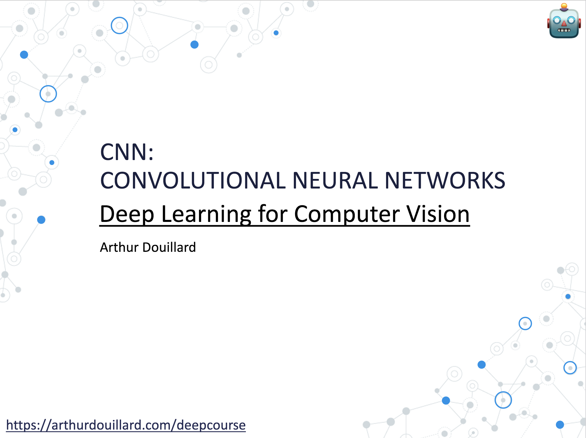

# Before the lecture

- Quick glance at the [wikipedia page of convolution kernels](https://en.wikipedia.org/wiki/Kernel_(image_processing))

# The lecture

# After the lecture

Emblematic papers about new architectures to read:
- [VGG, Simonyan and Zisserman 2014](https://arxiv.org/abs/1409.1556)
- [Inception, Szegedy et al. CVPR 2015](https://arxiv.org/abs/1409.4842)
- [ResNet, He et al. ECCV 2016](https://arxiv.org/abs/1512.03385)
- [EfficientNet, Tan et al. ICML 2019](https://arxiv.org/abs/1905.11946)

Other papers worth reading:
- [Dropout, Srivastava et al. JMLR 2014](https://jmlr.org/papers/v15/srivastava14a.html)
- [Batch Normalization, Ioffe et al. ICML 2015](https://arxiv.org/abs/1502.03167)

Some blog posts:
- About different architectures that are designed to be fast: [3 Small but Powerful Convolutional Neural Networks](https://arthurdouillard.com/post/3-small-but-powerful-cnn/)
- The alternative to batch normalization: [Normalization in Deep Learning](https://arthurdouillard.com/post/normalization/)
