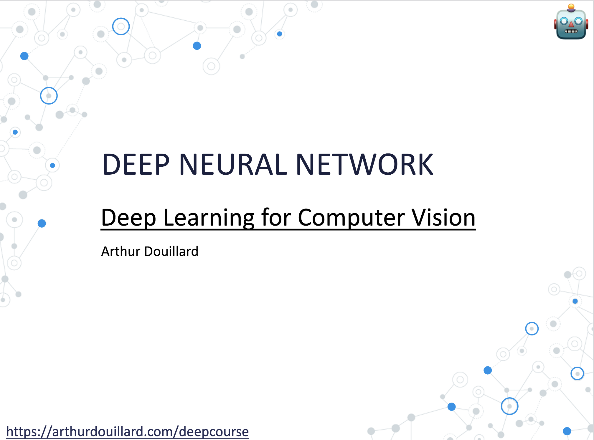

# Before the lecture

If you like videos, you can watch (as much as you can) the videos of 3Blue1Brown
on Neural Networks:


<iframe width="560" height="315" src="https://www.youtube.com/embed/aircAruvnKk" title="YouTube video player" frameborder="0" allow="accelerometer; autoplay; clipboard-write; encrypted-media; gyroscope; picture-in-picture" allowfullscreen></iframe>


- if you need to brush up your skills in linear algebra: [Hui's medium blog post](https://jonathan-hui.medium.com/machine-learning-linear-algebra-a5b1658f0151)

# The lecture

# After the lecture

- [Ruder's overview of gradient-descent based optimizer](https://ruder.io/optimizing-gradient-descent/) (SGD, momentum, Adam, etc.)
- try re-deriving by yourself, on a sheet of paper, all the maths that were covered
- [Overview of optimization](https://www.deeplearningbook.org/contents/optimization.html) from the famous "deeplearningbook"
- [In-depth explications about momentum](https://distill.pub/2017/momentum/) on distill.pub

- [Neural network playground](https://playground.tensorflow.org/)

- [Karpathy's "Yes, you should understand backprop"](https://karpathy.medium.com/yes-you-should-understand-backprop-e2f06eab496b)
