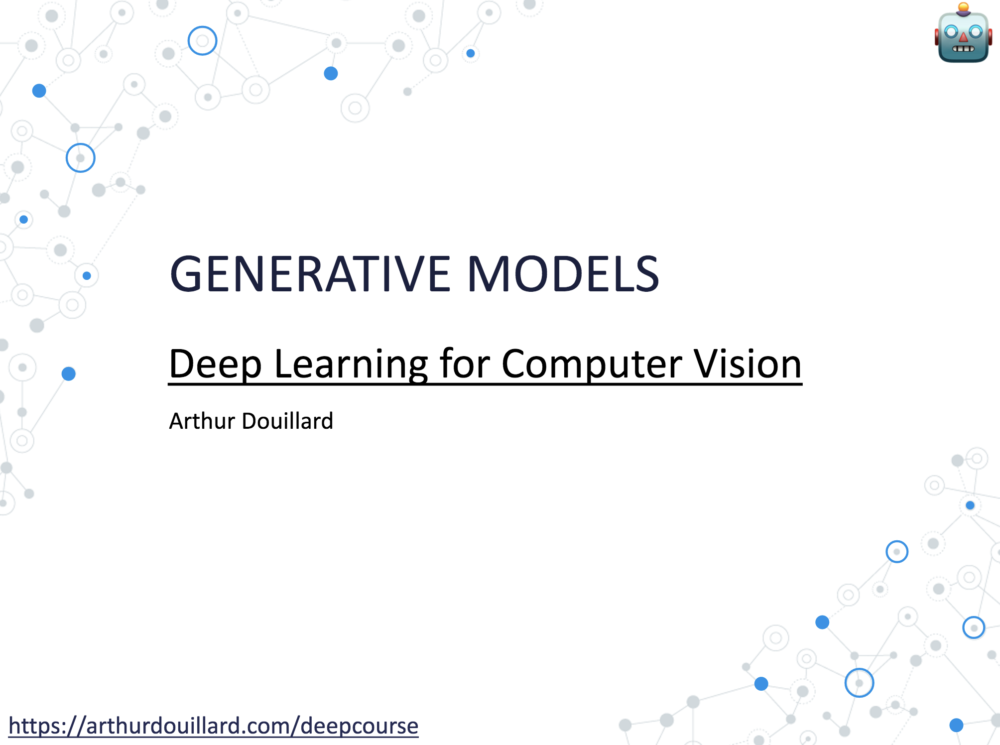

# The lecture

# After the lecture

- [Blog on auto-encoder, VAE, and beta-VAE](https://lilianweng.github.io/lil-log/2018/08/12/from-autoencoder-to-beta-vae.html)
- [Training tricks for GAN](https://beckham.nz/2021/06/28/training-gans.html)
- [Youtube video on the demonstration of VAE](https://www.youtube.com/watch?v=uaaqyVS9-rM&t=1182s)

- [Stanford's course on generative models](https://deepgenerativemodels.github.io)

- [Tutorial on Style Transfer](https://pytorch.org/tutorials/advanced/neural_style_tutorial.html)
- [Paper on why Style Transfer works better with VGG than ResNet](https://arxiv.org/abs/2104.05623)

- [Lilian Weng on Normalizing Flows](https://lilianweng.github.io/lil-log/2018/10/13/flow-based-deep-generative-models.html)

- [Generate yourself amazing artworks with VQGAN+CLIP [Google Colab]](https://colab.research.google.com/drive/1Foi0mCSE6NrW9oI3Fhni7158Krz4ZXdH)
- [[Non-technical] Visual generated by CLIP and BigSleep](https://ml.berkeley.edu/blog/posts/clip-art/)
- [[Non-technical] Which face is real? Generated by a GAN](https://www.whichfaceisreal.com/)
