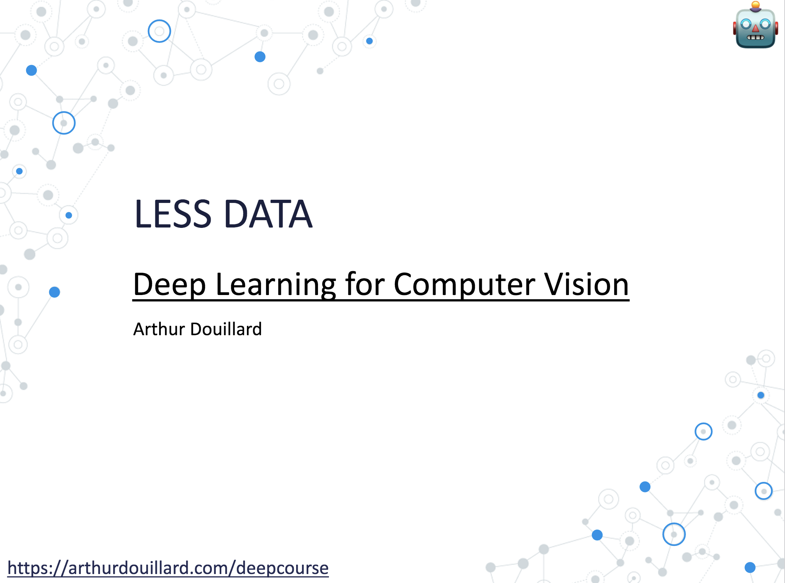

# The lecture

# After the lecture

Emblematic papers about new architectures to read:

Blog posts:
- [On the Triplet Network](https://omoindrot.github.io/triplet-loss)
- [Self-Supervised Learning](https://lilianweng.github.io/lil-log/2019/11/10/self-supervised-learning.html)
- [Twitter thread on recent advances in self-supervision](https://twitter.com/araffin2/status/1405527019102760965)

Papers on few-shot learning:
- [Triplet Network](https://arxiv.org/abs/1412.6622)
- [Siamese Network for one-shot learning](https://www.cs.cmu.edu/~rsalakhu/papers/oneshot1.pdf)

Papers on self-supervision:
- [SimCRL](https://arxiv.org/abs/2002.05709)
- [MoCo v1](https://arxiv.org/abs/1911.05722)
- [BYOL](https://arxiv.org/abs/2006.07733)
- [Barlow Twins](https://arxiv.org/abs/2103.03230)

Papers on domain adaptation:
- [DANN and its Gradient Reversal Layer](https://arxiv.org/abs/1505.07818)
- [AdaptSegNet](https://arxiv.org/abs/1802.10349)

Paper on weak-supervision:
- [Weak supervised training on Instagram's hashtags](https://arxiv.org/abs/1805.00932)
