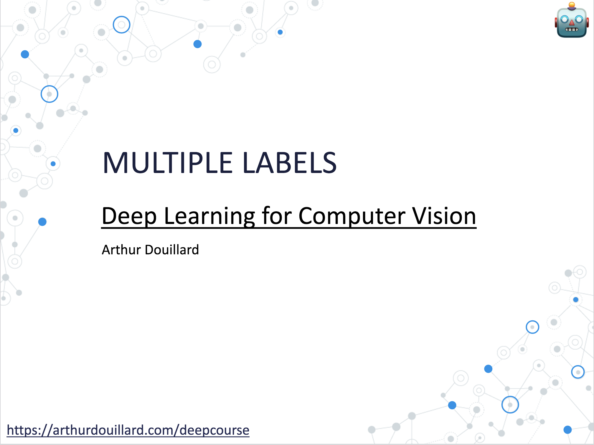

# The lecture

# After the lecture

Emblematic papers about new architectures to read:

Series of blog posts:
- [Selective Search](https://arthurdouillard.com/post/selective-search/)
- [Fast and Faster R-CNN](https://arthurdouillard.com/post/faster-rcnn/)

Papers:
- [Fully Convolutional Network](https://arxiv.org/abs/1411.4038)
- [U-Net & its experiments on medical data!](https://arxiv.org/abs/1505.04597)
- [DeepLab](https://arxiv.org/abs/1606.00915)
- [Axial DeepLab](https://arxiv.org/abs/2003.07853)
